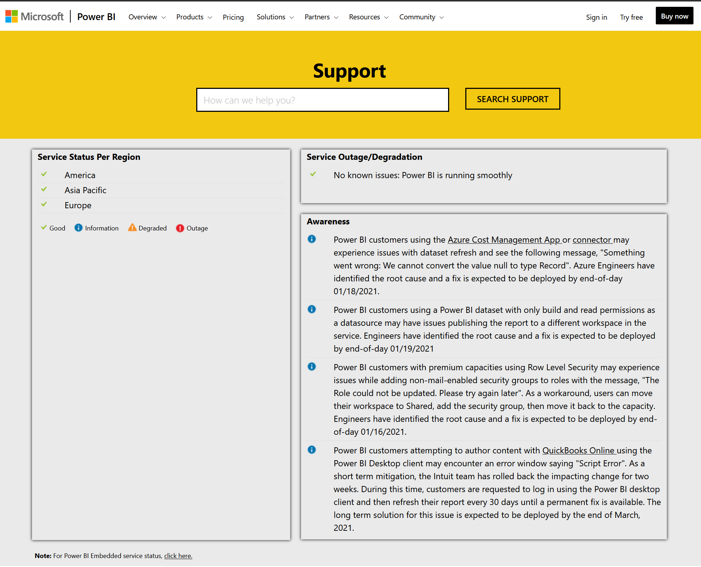
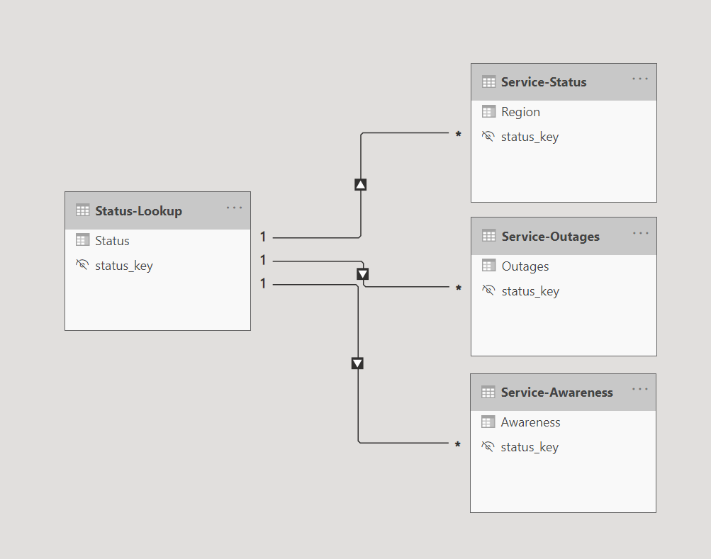
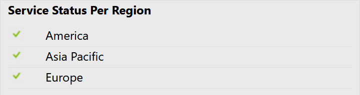
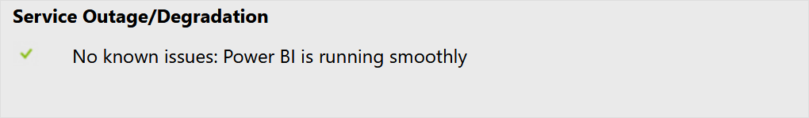

# PowerBI Service Status

## About

A dataset only PowerBI template that extracts the information from [https://powerbi.microsoft.com/en-us/support/](https://powerbi.microsoft.com/en-us/support/) into 4 datasets.

## DataModel

### `Service-Status`

The current status of PowerBI service in the various regions

### `Service-Outages`

Any Service Outage/Degradation as listed on PowerBI status page.

### `Service-Awareness`

Any "Awareness" published on PowerBI status page

### `Status-Lookup`

A lookup of the various statuses

